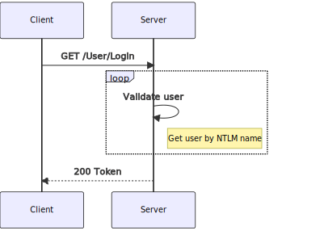
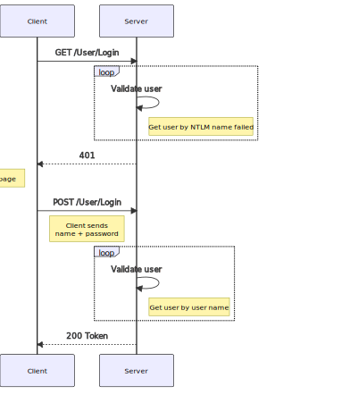

# WebAPIAuth

Weather forecast test API with authorization. This example is based on default weather forecast Visual Studio template.

Combine NTLM, JWT Bearer and API key authentication.

## Login flow for interactive users

JS application in browser try to use GET User/Login and if response is not 200 apllication shows login page and then try to use POST User/Login with given name and password.

Login flow with successful NTLM authentication.



Login flow with failed NTLM authentication and user/password fallback.



## API Key Authentication

API key auth is for service clients without user interaction. Solution contains simple API key scheme authentication. Any service could use valid API Key in `X-API-KEY` header.

See also https://matteosonoio.it/aspnet-core-authentication-schemes/ 
and https://stackoverflow.com/a/75059938/1498252

Or use API KEY Auth https://github.com/mihirdilip/aspnetcore-authentication-apikey library.

## Example console client using user login name/password

```csharp
using System.ComponentModel.DataAnnotations;
using System.Net.Http.Headers;
using System.Net.Http.Json;
using System.Text;

namespace WetaherForecastAPIClient
{
    // Weather forecast client model
    public class WeatherForecast
    {
        public DateTime Date { get; set; }
        public int TemperatureC { get; set; }
        public int TemperatureF { get; set; }
        public string? Summary { get; set; }
    }

    // Login user POST requuest model
    public class LoginUser
    {
        public string? UserName { get; set; }
        public string? Password { get; set; }
    }

    // Login user response model
    public class LoginResponse
    {
        public string? Token { get; set; }
    }

    internal class Program
    {
        static string baseUrl = "https://localhost:44310/api/";
        static async Task Main(string[] args)
        {
            Console.WriteLine($"API base ULR: {baseUrl}");
            var handler = new HttpClientHandler
            {
                ServerCertificateCustomValidationCallback = (request, cert, chain, errors) =>
                {
                    // !!! DANGER !!! No server certificate validation
                    return true;
                }
            };
            HttpClient client = new HttpClient(handler);
            client.BaseAddress = new Uri(baseUrl);
            try
            {
                var user = new LoginUser() { UserName = "john", Password = "P@ssw0rd" };
                var response = await client.PostAsJsonAsync("User/Login", user);
                response.EnsureSuccessStatusCode();

                var token = await response.Content.ReadFromJsonAsync<LoginResponse>();
                // token can be null !!!
                client.DefaultRequestHeaders.Authorization = new AuthenticationHeaderValue("Bearer", token.Token);

                var forecast = await client.GetFromJsonAsync<WeatherForecast[]>("WeatherForecast");
                if (forecast != null)
                {
                    Console.WriteLine("WeatherForecast:");
                    foreach (var item in forecast)
                    {
                        Console.WriteLine($"  {item.Date:d}\t{item.TemperatureC}°C\t{item.Summary}");
                    }
                }
            }
            catch (HttpRequestException ex)
            {
                Console.WriteLine($"Status: '{ex.StatusCode}' with message '{ex.Message}'");
            }


        }
    }
}
```

## Example console client using API Key

```csharp
using System.Net.Http.Json;
using System.Text;

namespace WetaherForecastAPIClient
{
    // Weather forecast client model
    public class WeatherForecast
    {
        public DateTime Date { get; set; }
        public int TemperatureC { get; set; }
        public int TemperatureF { get; set; }
        public string? Summary { get; set; }
    }

    internal class Program
    {
        static string baseUrl = "https://localhost:44310/api/";
        static async Task Main(string[] args)
        {
            Console.WriteLine($"API base ULR: {baseUrl}");
            var handler = new HttpClientHandler
            {
                ServerCertificateCustomValidationCallback = (request, cert, chain, errors) =>
                {
                    // !!! DANGER !!! No server certificate validation
                    return true;
                }
            };
            HttpClient client = new HttpClient(handler);
            client.BaseAddress = new Uri(baseUrl);
            client.DefaultRequestHeaders.Add("X-API-KEY", "API-KEY-123");
            try
            {
                var forecast = await client.GetFromJsonAsync<WeatherForecast[]>("WeatherForecast");
                if (forecast != null)
                {
                    Console.WriteLine("WeatherForecast:");
                    foreach (var item in forecast)
                    {
                        Console.WriteLine($"  {item.Date:d}\t{item.TemperatureC}°C\t{item.Summary}");
                    }
                }
            }
            catch (HttpRequestException ex)
            {
                Console.WriteLine($"Status: '{ex.StatusCode}' with message '{ex.Message}'");
            }
        }
    }
}
```